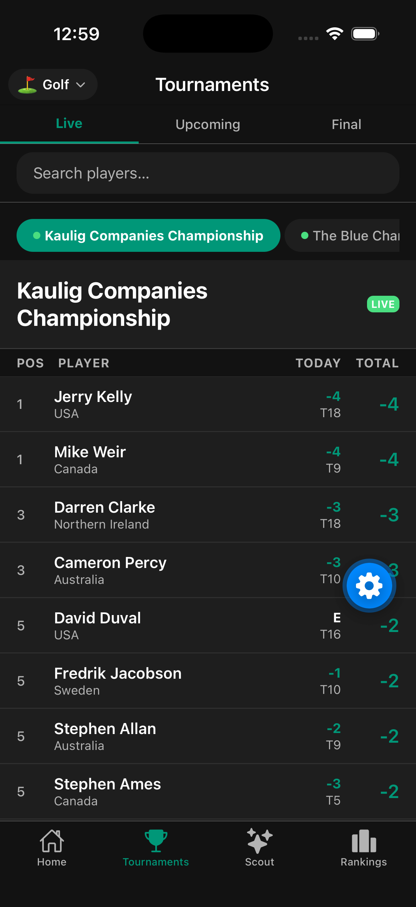
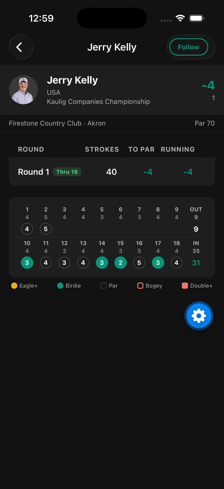
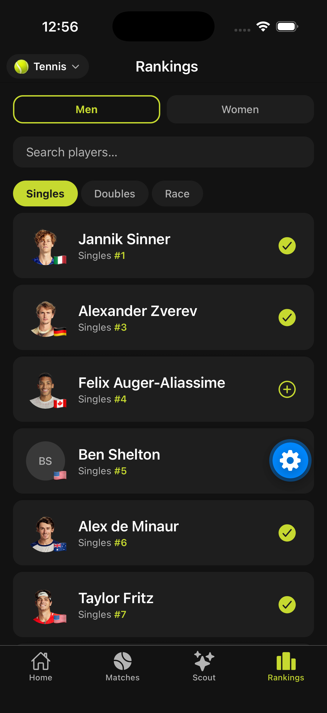
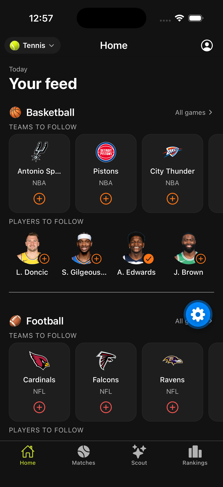
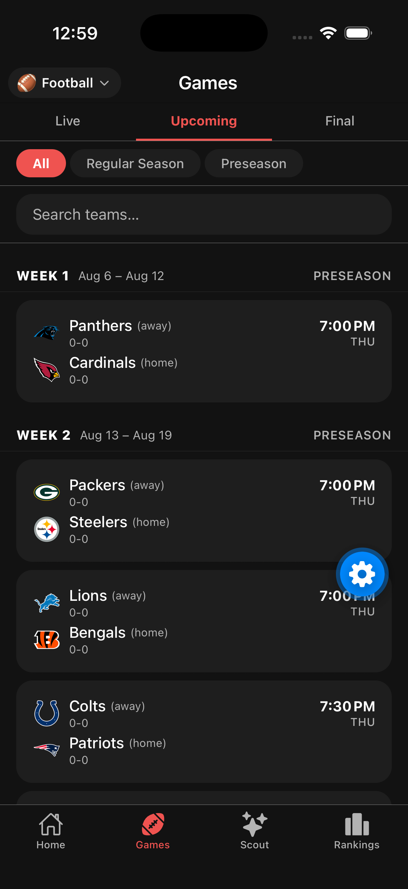
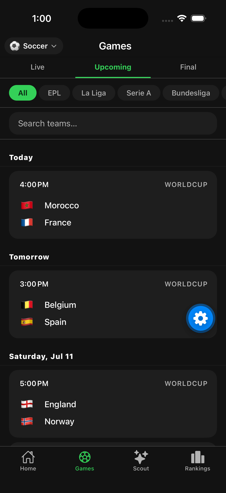
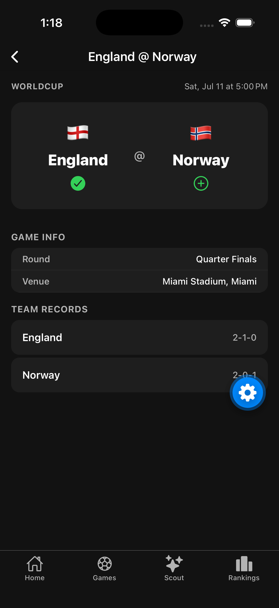
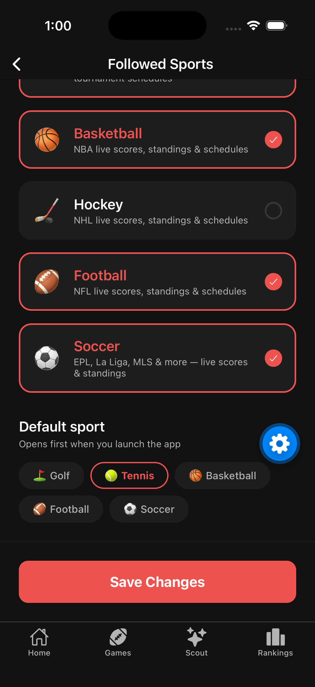

# Juno

A cross-sport fan engagement app built with React Native (Expo) and TypeScript. One app, six sports — live scores, player/team follows, rankings, and AI-powered match scouting, all switchable at runtime from a single codebase.

Backed by [Artemis](../artemis), a Phoenix umbrella API that ingests live tournament/match data and pushes real-time updates over WebSockets.

## Screenshots

<p float="left">
  
  
  
  
</p>
<p float="left">
  
  
  
  
</p>

## Features

- **Live scores across 6 sports** — golf, tennis, basketball, hockey, football, and soccer, with real-time updates pushed over Phoenix WebSocket channels (no polling for live games/matches)
- **Runtime sport switching** — one app, not six; switch your active sport from an in-app picker and the whole UI (tabs, theme, data) re-keys instantly
- **Follow players & teams** — personalized feed of the players/teams you care about
- **Rankings** — golf world rankings, tennis ATP/WTA rankings, and standings for the four team sports
- **AI match scout** — Claude-powered analysis of head-to-head matchups and lineups, gated behind a lightweight credits system
- **Push notifications** for followed players/teams via Expo Notifications

## Tech Stack

- **Expo** (React Native) with **Expo Router** for file-based navigation
- **TypeScript** throughout
- **Turborepo** monorepo (npm workspaces)
- **Phoenix Channels** (`phoenix` npm package) for live WebSocket updates
- **Expo SecureStore** for session persistence

## Structure

```
juno/
├── apps/
│   └── main/     # The one and only app — all six sports live here
├── packages/
│   ├── api/      # @juno/api — REST + WebSocket clients, one module per sport
│   ├── ui/       # @juno/ui — shared components (PlayerCard, LiveBadge) + theme tokens
│   └── config/   # Shared tsconfig + eslint config
```

Which sport is "active" is session state in React (`SportProvider`), not a routing or build-time concern — the tab bar adapts per sport rather than having a separate route tree for each one.

## Requirements

- Node 18+
- [Expo Go](https://expo.dev/go) on your phone, or an iOS Simulator / Android Emulator
- The [Artemis](../artemis) backend running locally at `http://localhost:4000`

## Setup

```bash
# 1. Install dependencies (all workspaces)
npm install

# 2. Copy the env file (Expo reads env per-app, not from the monorepo root)
cp .env.example apps/main/.env
# Edit apps/main/.env — use your machine's LAN IP instead of localhost
# if you're testing on a physical device
```

## Running

```bash
npm run start          # expo start, from the repo root

# or from within the app directory:
cd apps/main
npx expo start
npm run ios            # --ios
npm run android         # --android
```

Scan the QR code with Expo Go, or press `i` for the iOS simulator / `a` for Android.

## Environment Variables

Set in `apps/main/.env`, prefixed `EXPO_PUBLIC_` so they're bundled into the RN app:

| Variable | Description | Default |
|----------|-------------|---------|
| `EXPO_PUBLIC_API_URL` | Juno REST base URL | `http://localhost:4000` |
| `EXPO_PUBLIC_WS_URL` | Juno WebSocket URL | `ws://localhost:4000/socket` |

## Other Commands

```bash
npm run build       # expo export, all workspaces
npm run lint        # eslint, all workspaces
npm run typecheck   # tsc --noEmit, all workspaces
```
